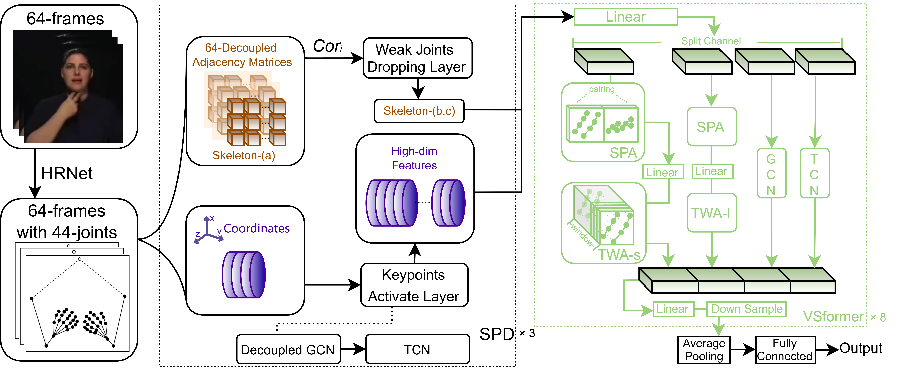

# VSNet: Focusing on the Linguistic Characteristics of Sign Language
## Introduction

This project is designed for skeleton-based action/sign recognition.  
The input `data` contains complete skeleton keypoints. During preprocessing, the feeder selects **44 keypoints**, followed by grouping and reordering operations.



## Training

To start training, set the `--config` argument in `main.py` to a configuration file under:

```bash
config/train/
```

Example:

```bash
python main.py --config config/train/xxx.yaml
```

---

## Testing

For evaluation/testing, use the configuration files under:

```bash
config/test/
```

Example:

```bash
python main.py --config config/test/xxx.yaml
```

---

## Data Type Configuration

### Joint Modality

To use **joint-based input**, set:

```python
data_type = 'j'
```

### Bone Modality

To use **bone-based input**, set:

```python
data_type = 'b'
```

---

## 4-Crops Grouping Strategy

If you want to use the alternative grouping strategy for **4-crops**, modify the feeder file to:

```bash
*_44_f2.py
```

or

```bash
*_44_f4.py
```

depending on the desired grouping setting.

## Acknowledgement

This project is partially based on the following open-source repositories and their corresponding papers:

- [CVPR21Chal-SLR](https://github.com/jackyjsy/CVPR21Chal-SLR)
- [SkateFormer](https://github.com/KAIST-VICLab/SkateFormer)

We sincerely thank the authors for making their code and research publicly available.


